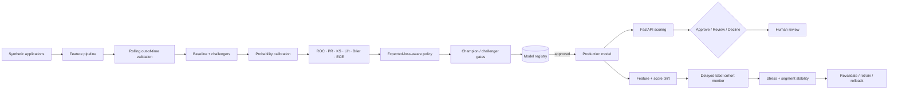

# Banking Risk ML Platform

A runnable, synthetic **global-banking risk decision platform** spanning data-safe validation, probability modeling, business policy, model governance, deployment and post-production monitoring.

> **Portfolio reference implementation.** All data, costs, policies and outcomes are synthetic. No customer, employer or confidential banking data is included, and this repository is not presented as a regulatory credit model.

## Architecture



## Why this project exists

A banking model is not finished when `fit()` returns. Production decisions depend on questions such as:

- Was validation truly forward-looking, or did future information leak into training?
- Are probabilities calibrated enough to support economic decisions?
- What threshold policy fits risk appetite **and** manual-review capacity?
- Does a challenger improve business outcomes without breaking latency or calibration?
- How do we monitor performance when labels arrive 60–90+ days later?
- What happens under population shift or an adverse economic scenario?
- Is overall performance hiding a weak country, channel or customer segment?
- Can every deployed artifact and human override be audited?

This repository makes those concerns executable instead of hiding them in presentation slides.

## Core implementation

### 1. Modeling and out-of-time validation

- deterministic synthetic credit-risk data generation;
- numeric/categorical preprocessing;
- `HistGradientBoostingClassifier` production-style baseline;
- optional **XGBoost** and **LightGBM** challengers;
- optional **Optuna** hyperparameter tuning;
- expanding / rolling **out-of-time validation** with configurable temporal gaps;
- fold-level stability rather than a single random holdout.

`src/temporal_validation.py` deliberately keeps future periods out of training:

```text
historical train ------> gap -> future validation
historical train grows --------> gap -> later validation
```

### 2. Banking-oriented probability metrics

`src/banking_metrics.py` covers:

- ROC-AUC;
- average precision / PR-AUC;
- KS statistic;
- Lift@10%;
- Brier score;
- expected calibration error;
- calibration MAE;
- approval / review / bad-rate operating curves.

The repository treats discrimination, probability quality and business policy as different questions.

### 3. Probability calibration

`src/calibration.py` compares:

- uncalibrated probabilities;
- sigmoid / Platt-style calibration;
- isotonic calibration.

Training, calibration and final evaluation are kept separate. The utility supports modern `FrozenEstimator`-based scikit-learn calibration while retaining compatibility with older supported APIs.

### 4. Cost-sensitive decision policy

`src/cost_sensitive_policy.py` maps probability estimates onto explicit economics:

- false-approval cost;
- false-decline cost;
- manual-review cost;
- value of a correctly approved application;
- maximum review capacity;
- minimum approval rate;
- minimum adverse-event capture;
- two-threshold approve / review / decline search;
- illustrative `Expected Loss = PD × LGD × EAD` decomposition.

```python
from src.cost_sensitive_policy import CostModel, search_policy

policies = search_policy(
    y_true,
    probabilities,
    costs=CostModel(
        false_approve_cost=8500,
        false_decline_cost=450,
        manual_review_cost=18,
        true_approve_value=120,
    ),
    max_review_rate=0.25,
    min_approval_rate=0.30,
    min_default_capture_rate=0.80,
)
```

The question becomes **“Which policy satisfies business/risk constraints at lowest expected cost?”**, not merely “Which threshold maximizes F1?”

### 5. Champion / challenger governance

`src/champion_challenger.py` blocks a challenger when improved discrimination comes with unacceptable regressions in:

- Brier/calibration quality;
- expected business cost;
- p95 inference latency;
- PSI / evaluation-population stability;
- human-review workload.

A challenger does not become production merely because its AUC is 0.004 higher.

### 6. Drift and segment stability

`src/drift_monitoring.py` provides PSI and two-sample KS diagnostics for features and model scores.

`src/segment_validation.py` breaks performance and decision outcomes down by country/channel/segment:

- sample size and event rate;
- ROC-AUC / AP / Brier;
- approval / review / decline rates;
- bad rate among approved cases;
- adverse-event capture;
- investigation flags for large gaps or tiny samples.

A drift statistic is treated as a **diagnostic signal**, not proof that predictive performance failed.

### 7. Delayed-label monitoring

`src/delayed_label_monitoring.py` addresses a common banking monitoring trap: a recent account with no 90-day bad outcome yet is **not automatically a negative label**.

The monitor:

1. applies an outcome-horizon + reporting-lag maturity cutoff;
2. joins only eligible predictions to outcomes;
3. exposes missing mature labels as data-quality failures;
4. reports mature cohorts separately;
5. calculates AUC, AP, Brier and calibration gaps only when labels are actually mature.

This separates immediate **input/score drift** monitoring from later **outcome-based performance** monitoring.

### 8. Stress testing

`src/stress_testing.py` applies synthetic deterioration scenarios through:

- log-odds shifts in PD;
- PD multipliers;
- LGD multipliers;
- exposure/balance multipliers.

It reports expected-loss uplift and how the fixed approve/review/decline policy behaves under mild, recession and severe-downturn scenarios.

### 9. Feature stability

`src/feature_stability.py` measures whether feature importance is reproducible across folds/runs using:

- mean absolute importance;
- standard deviation / coefficient of variation;
- sign consistency;
- top-k frequency;
- Spearman rank stability.

This is useful when a model looks strong overall but its apparent drivers change wildly between periods.

## Advanced research layer

Install optional dependencies:

```bash
pip install -r requirements-advanced.txt
```

Then explore:

- `advanced/model_benchmark.py` — XGBoost + LightGBM + Optuna;
- `advanced/imbalance_benchmark.py` — class weighting, random over/under-sampling and SMOTE;
- `advanced/shap_explain.py` — actual SHAP `TreeExplainer` utilities;
- `advanced/scorecard_woe.py` — Weight of Evidence / Information Value scorecard lab.

WoE/IV thresholds are presented as heuristics rather than laws; suspiciously high IV is explicitly treated as a reason to investigate leakage or instability.

## Explainability

Two explanation approaches are intentionally kept distinct:

1. `src/explainability.py` — transparent local **perturbation/sensitivity analysis**;
2. `advanced/shap_explain.py` — actual **SHAP** for supported tree models.

The project does not rename an arbitrary heuristic “SHAP.” Attribution is treated as diagnostic evidence, not causality.

## Selection bias and reject inference

`docs/selection_bias_and_reject_inference.md` discusses why outcomes may only be observed for applicants accepted by a historical policy.

It covers parceling, weighting, model-based inference and controlled exploration as assumption-dependent approaches, and emphasizes that **SMOTE does not solve reject inference**.

## Registry, serving and auditability

- persistent SQLite model registry;
- immutable model metadata;
- SHA-256 artifact verification;
- candidate → production → archived lifecycle;
- explicit promotion reasons;
- FastAPI `/score`, `/models`, `/health` and review endpoints;
- Docker image;
- human override / automation-bias evaluation;
- pytest, Ruff and container-build CI;
- `MODEL_CARD.md` governance checklist.

## Quick start

```bash
python -m venv .venv
source .venv/bin/activate  # Windows: .venv\Scripts\activate
pip install -r requirements.txt

python -m src.train_and_register \
  --artifact-dir artifacts/model \
  --registry artifacts/registry.db \
  --rows 12000 \
  --promote

uvicorn app.api:app --reload
```

Open `/docs` for the generated OpenAPI interface.

## Public banking platform story

This repository is the **risk/model-decision layer** of a larger public stack:

| Repository | Role |
|---|---|
| `fintech-data-platform` | Contracts, Bronze/Silver, Parquet, dbt, Airflow, PostgreSQL, PySpark batch + Structured Streaming |
| `banking-risk-ml-platform` | Training, validation, calibration, policy, governance, serving, monitoring |
| `fraud-streaming-platform` | Streaming fraud signals and analyst-review routing |
| `transaction-graph-fraud` | Graph-based transaction-risk patterns |
| `gcp-ml-platform` | BigQuery + Vertex AI pipelines, model registry and endpoint examples |
| `model-drift-monitoring` | Generic production drift patterns |
| `financial-crime-copilot` | Structured human-review / evidence workflows |

## Interview preparation

- `docs/senior_data_science_interview.md` — ~50 concise ML/statistics/Spark/GCP/business questions;
- `docs/MOCK_TAKE_HOME.md` — full synthetic Global Banking take-home;
- `sql/interview_queries.sql` — windows, temporal features, cohorts, anti-joins, deduplication and analytical SQL;
- `MODEL_CARD.md` — model-risk and deployment governance checklist.

## Topics this repository can support in an interview

**Temporal leakage · probability calibration · ROC vs PR-AUC · KS · lift · Brier · expected loss · PD/LGD/EAD · threshold economics · human-review capacity · champion/challenger · XGBoost · LightGBM · Optuna · class imbalance · SMOTE limitations · SHAP · WoE/IV · PSI · delayed labels · segment stability · stress testing · reject inference · model registry · FastAPI · Docker · CI/CD · auditability.**
