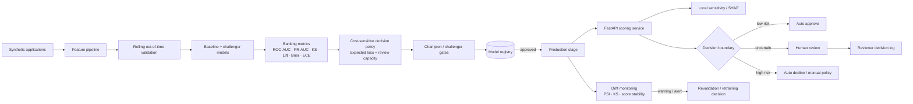

# Banking Risk ML Platform

A runnable, synthetic **credit-risk decision platform** that demonstrates the full path from reproducible model training to temporal validation, banking-specific metrics, expected-loss-aware thresholding, champion/challenger governance, model registry, controlled deployment, online scoring, explanations, human-review routing and drift monitoring.

> All examples are synthetic. No customer, employer or confidential banking data is included.

## Architecture



## What is implemented

### Modeling and validation

- deterministic synthetic credit-risk data generation;
- preprocessing for numeric and categorical features;
- `HistGradientBoostingClassifier` baseline;
- optional **XGBoost and LightGBM challenger models**;
- optional **Optuna** hyperparameter search with order-preserving validation;
- rolling / expanding **out-of-time validation** with a configurable temporal gap;
- fold-level stability reporting instead of relying on a single random split;
- explicit separation between model ranking, probability quality and business operating points.

### Advanced model research layer

Install the optional research dependencies with:

```bash
pip install -r requirements-advanced.txt
```

The `advanced/` directory contains:

- `model_benchmark.py` — XGBoost / LightGBM benchmark and Optuna tuning;
- `imbalance_benchmark.py` — class weighting, over-sampling, SMOTE and under-sampling comparison;
- `shap_explain.py` — actual SHAP TreeExplainer utilities, deliberately separated from the repository's simpler perturbation explainer.

`src/feature_stability.py` measures mean importance, variance, sign consistency, top-k selection frequency and Spearman rank stability across folds/runs.

### Champion / challenger governance

`src/champion_challenger.py` evaluates whether a challenger should replace the current champion. Promotion is blocked when gains in discrimination come with unacceptable regressions in:

- calibration / Brier score;
- expected business cost;
- p95 serving latency;
- population stability;
- human-review workload.

This is intentionally stricter than selecting the model with the highest AUC.

### Banking-oriented evaluation

`src/banking_metrics.py` implements:

- ROC-AUC;
- average precision / PR-AUC;
- Brier score;
- KS statistic;
- Lift@10%;
- expected calibration error;
- calibration MAE;
- approval / bad-rate / review-rate decision curves.

`src/cost_sensitive_policy.py` then connects model outputs to business decisions with:

- asymmetric false-approve and false-decline costs;
- manual-review cost;
- optional value of a correctly approved customer;
- review-capacity constraints;
- minimum approval-rate constraints;
- minimum default-capture constraints;
- grid search over two-threshold approve / review / decline policies;
- a transparent `PD × LGD × EAD` expected-loss example.

This is intentionally more realistic than treating a probability threshold as a purely statistical tuning parameter.

### Drift and production stability

`src/drift_monitoring.py` provides:

- Population Stability Index (PSI);
- two-sample KS diagnostics;
- feature-level drift reports;
- model-score distribution monitoring;
- monthly drift reports against a chosen reference period;
- stable / warning / alert severity bands.

A drift signal is treated as a **diagnostic**, not proof that model performance failed. Outcome-based performance must be re-evaluated when labels become available.

### Governance and serving

- persistent model registry with immutable version metadata and SHA-256 artifact verification;
- candidate → production → archived lifecycle and explicit promotion reasons;
- quality-gated `train_and_register` workflow;
- FastAPI `/score`, `/models`, `/health` and human-review endpoints;
- conservative automation boundaries: uncertain cases are intentionally deferred;
- model-agnostic one-feature counterfactual sensitivity explanations;
- Docker image that trains/registers a public demo model before serving;
- pytest + Ruff + container-build CI;
- human-review evaluation utilities for override and automation-bias analysis;
- `MODEL_CARD.md` with intended use, limitations, monitoring and a promotion checklist.

## Quick start

```bash
python -m venv .venv
source .venv/bin/activate  # Windows: .venv\Scripts\activate
pip install -r requirements.txt

python -m src.train_and_register \
  --artifact-dir artifacts/model \
  --registry artifacts/registry.db \
  --rows 12000 \
  --promote

uvicorn app.api:app --reload
```

Open `/docs` for the generated OpenAPI UI.

### Example score request

```json
{
  "application_id": "app-1001",
  "age": 34,
  "income": 72000,
  "debt": 11000,
  "utilization": 0.42,
  "late_payments": 1,
  "account_age_months": 61,
  "employment": "salaried",
  "housing": "mortgage"
}
```

The response contains the default probability, model version, decision route and a local explanation with the highest-sensitivity features.

## Temporal validation

`src/temporal_validation.py` provides forward-looking evaluation folds:

```text
historical training window
        ↓
configurable gap
        ↓
future test month
        ↓
expand training window
        ↓
next future test month
```

This avoids the common portfolio mistake of randomly mixing future observations into training for a problem that will be deployed forward in time.

## Expected-loss and decision-policy example

```python
from src.cost_sensitive_policy import CostModel, search_policy

policies = search_policy(
    y_true,
    default_probabilities,
    costs=CostModel(
        false_approve_cost=8500,
        false_decline_cost=450,
        manual_review_cost=18,
        true_approve_value=120,
    ),
    max_review_rate=0.25,
    min_approval_rate=0.30,
    min_default_capture_rate=0.80,
)

print(policies.head())
```

Instead of asking only *"which threshold maximizes F1?"*, the system can discuss *"which policy meets review capacity while controlling bad approvals and expected economic cost?"*

## Model governance

Promotion is deliberately separate from training. A candidate can only be promoted when explicit quality gates pass. The registry stores:

- model version;
- artifact path and SHA-256 checksum;
- creation timestamp;
- evaluation metrics;
- deployment stage;
- promotion reason/history.

The API verifies the production artifact checksum before loading it. This makes the project useful for discussing **model lineage, reproducibility and controlled deployment**, not only classifier training.

See `MODEL_CARD.md` for the public governance checklist and `src/champion_challenger.py` for executable promotion policy logic.

## Human + AI decision design

The service does not equate probability with an automatic business decision. Low-risk examples can be routed automatically while uncertain/high-risk cases are deferred for explicit human review. Reviewer actions are logged separately from model outputs, making override-rate and automation-bias analysis possible with the repository's evaluation utilities.

## Explanation note

`src/explainability.py` implements transparent local perturbation analysis rather than pretending a custom heuristic is SHAP. Each feature is replaced with a conservative reference value and the change in predicted probability is measured.

For supported tree challengers, `advanced/shap_explain.py` uses the actual SHAP library and labels the output accordingly. Attribution is treated as a diagnostic explanation, not a causal claim.

## Cross-repository platform story

This repository is the **model/risk-decision layer** of a larger public banking portfolio:

- `fintech-data-platform` — data contracts, Bronze/Silver layers, Airflow, dbt, PostgreSQL and PySpark feature engineering;
- `fraud-streaming-platform` — streaming fraud signals and analyst review queues;
- `transaction-graph-fraud` — graph-based transaction-risk patterns;
- `gcp-ml-platform` — BigQuery and Vertex AI deployment/pipeline examples;
- `model-drift-monitoring` — generic production drift patterns;
- `financial-crime-copilot` — structured human-review workflows.

## Interview preparation material

- `docs/senior_data_science_interview.md` — **50 concise questions and answers** covering end-to-end ML, banking metrics, statistics, Spark, GCP, governance and business framing.
- `docs/MOCK_TAKE_HOME.md` — a full synthetic Global Banking take-home covering leakage, temporal validation, Spark, GCP, threshold economics, monitoring and system design.
- `sql/interview_queries.sql` — SQL patterns for temporal features, windows, cohorts, anti-joins, deduplication and analytical queries.

## Interview topics this repository supports

- ROC-AUC vs PR-AUC vs KS vs Lift;
- probability calibration and Brier score;
- class imbalance, SMOTE and threshold tuning;
- XGBoost / LightGBM champion-challenger comparison;
- hyperparameter optimization with Optuna;
- feature stability across folds;
- SHAP vs perturbation-based sensitivity analysis;
- expected loss and cost-sensitive policies;
- approval / bad-rate / review-capacity trade-offs;
- random split vs out-of-time validation;
- feature and score drift with PSI / KS;
- model registry and promotion gates;
- online vs batch risk scoring;
- human escalation and automation bias;
- feature preprocessing and leakage;
- artifact integrity and reproducibility;
- FastAPI serving, Docker and CI/CD;
- explanation methods and their limitations.
