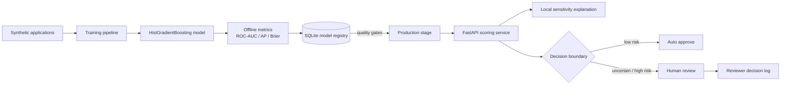

# Banking Risk ML Platform

A runnable, synthetic **credit-risk decision platform** that demonstrates the full path from reproducible model training to registry, promotion gates, online scoring, explanations and human-review routing.

> All examples are synthetic. No customer, employer or confidential banking data is included.

## Architecture



## What is implemented

- deterministic synthetic credit-risk data generation;
- preprocessing for numeric and categorical features;
- `HistGradientBoostingClassifier` baseline;
- ROC-AUC, average precision and Brier-score evaluation;
- persistent model registry with immutable version metadata and SHA-256 artifact verification;
- candidate → production → archived lifecycle and explicit promotion reasons;
- quality-gated `train_and_register` workflow;
- FastAPI `/score`, `/models`, `/health` and human-review endpoints;
- conservative automation boundaries: uncertain cases are intentionally deferred;
- model-agnostic one-feature counterfactual sensitivity explanations;
- Docker image that trains/registers a public demo model before serving;
- pytest + Ruff + container-build CI;
- existing Spark/SQL examples and human-review evaluation utilities remain as supporting material.

## Quick start

```bash
python -m venv .venv
source .venv/bin/activate  # Windows: .venv\Scripts\activate
pip install -r requirements.txt

python -m src.train_and_register \
  --artifact-dir artifacts/model \
  --registry artifacts/registry.db \
  --rows 12000 \
  --promote

uvicorn app.api:app --reload
```

Open `/docs` for the generated OpenAPI UI.

### Example score request

```json
{
  "application_id": "app-1001",
  "age": 34,
  "income": 72000,
  "debt": 11000,
  "utilization": 0.42,
  "late_payments": 1,
  "account_age_months": 61,
  "employment": "salaried",
  "housing": "mortgage"
}
```

The response contains the default probability, model version, decision route and a local explanation with the highest-sensitivity features.

## Model governance

Promotion is deliberately separate from training. A candidate can only be promoted when explicit quality gates pass. The registry stores:

- model version;
- artifact path and SHA-256 checksum;
- creation timestamp;
- evaluation metrics;
- deployment stage;
- promotion reason/history.

The API verifies the production artifact checksum before loading it. This makes the project useful for discussing **model lineage, reproducibility and controlled deployment**, not only classifier training.

## Human + AI decision design

The service does not equate probability with an automatic business decision. Low-risk examples can be routed automatically while uncertain/high-risk cases are deferred for explicit human review. Reviewer actions are logged separately from model outputs, making override-rate and automation-bias analysis possible with the repository's evaluation utilities.

## Explanation note

`src/explainability.py` implements transparent local perturbation analysis rather than pretending a custom heuristic is SHAP. Each feature is replaced with a conservative reference value and the change in predicted probability is measured. The API labels the method and its limitation explicitly.

## Interview topics this repository supports

- ROC-AUC vs average precision vs calibration/Brier score;
- class imbalance and decision thresholds;
- model registry and promotion gates;
- online vs batch risk scoring;
- human escalation and automation bias;
- feature preprocessing and leakage;
- artifact integrity and reproducibility;
- FastAPI serving, Docker and CI/CD;
- explanation methods and their limitations.
