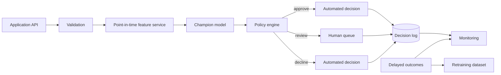

# Mock Take-Home — Senior Data Scientist, Global Banking

## Scenario

A global bank wants to reduce losses from newly booked retail accounts while preserving approval volume and keeping manual-review workload within operations capacity.

You receive three synthetic tables:

### `applications`

- `application_id`
- `customer_id`
- `application_time`
- `country`
- `channel`
- `income`
- `debt`
- `utilization`
- `late_payments`
- `account_age_months`
- `employment`
- `housing`

### `transactions`

- `transaction_id`
- `customer_id`
- `event_time`
- `amount`
- `merchant_category`
- `country`
- `channel`

### `outcomes`

- `application_id`
- `default_within_90d`
- `observed_at`
- `loss_amount`

Assume outcomes mature with delay, applications arrive continuously, and the final business policy has three routes: approve, decline, or manual review.

---

## Deliverable 1 — Data understanding

Write a short data-quality plan covering:

1. primary/foreign key checks;
2. duplicate applications/transactions;
3. missingness by time/country/channel;
4. impossible values and range checks;
5. event-time vs ingestion-time ordering;
6. outcome maturity / censoring;
7. train-serving feature availability;
8. target leakage risks.

### Strong-answer notes

A senior answer should notice that recently booked accounts may not yet have a mature 90-day label. Training on unresolved cases as negatives creates label bias. A reasonable design uses a cutoff that only includes sufficiently matured cohorts.

---

## Deliverable 2 — Feature engineering

Build point-in-time-safe features available at application time.

Suggested examples:

- transaction count / amount sum over prior 24h / 7d / 30d;
- time since previous transaction;
- merchant-category diversity;
- cross-border activity;
- night-time activity;
- deviation from personal historical amount distribution;
- peer-group z-score by country/channel/segment;
- debt-to-income ratio;
- utilization buckets;
- account tenure;
- recent late-payment count.

Explain why every window ends strictly before the decision timestamp.

---

## Deliverable 3 — Validation design

Do **not** use a naive random split as the main result.

Use rolling / expanding out-of-time validation:

```text
train past ----------------> gap -> validate future
train larger past --------------------> gap -> validate later future
```

Report fold-level:

- event rate;
- ROC-AUC;
- average precision;
- Brier score;
- KS;
- calibration error;
- approval/review/decline rates under the chosen policy.

Discuss what happens if performance is strong overall but unstable by country or month.

---

## Deliverable 4 — Baselines and challengers

At minimum compare:

- logistic regression;
- histogram gradient boosting;
- XGBoost or LightGBM challenger.

For class imbalance, compare at least two of:

- class weights;
- random over-sampling;
- random under-sampling;
- SMOTE;
- threshold tuning without resampling.

Explain why the best AUC model is not automatically the best production model.

---

## Deliverable 5 — Probability quality

Plot or calculate:

- calibration curve;
- Brier score;
- expected calibration error;
- score distributions for positives/negatives;
- lift at top deciles.

If probabilities are poorly calibrated, discuss Platt / isotonic calibration and the danger of calibrating on the same data used for model selection.

---

## Deliverable 6 — Business threshold policy

Assume illustrative unit economics:

- false approval of a future bad account: 8,500 cost units;
- false decline of a good account: 450;
- manual review: 18;
- good auto-approved account: 120 expected value.

Operations can manually review at most 25% of applications.

Search two thresholds:

```text
score < approve_threshold       -> approve
approve_threshold <= score < decline_threshold -> review
score >= decline_threshold      -> decline
```

Optimize expected cost subject to:

- review rate <= 25%;
- approval rate >= business minimum;
- adverse-event capture >= risk minimum.

Then stress-test the solution when the false-approval cost doubles.

---

## Deliverable 7 — Segment analysis

Produce a table by country and channel containing:

- sample size;
- event rate;
- ROC-AUC;
- AP;
- Brier;
- approval rate;
- bad rate among approved;
- review rate.

Flag segments with too little data separately instead of pretending noisy metrics are precise.

---

## Deliverable 8 — Explainability

Provide:

- global feature importance;
- local explanation for several approved/reviewed/declined cases;
- feature-importance stability across folds;
- clear statement that attribution is not causality.

If SHAP is used, use the real SHAP library and label it correctly.

---

## Deliverable 9 — Deployment architecture

Design an online scoring service with:



Discuss:

- idempotency;
- feature freshness;
- model/version metadata;
- latency budget;
- rollback;
- champion/challenger deployment;
- audit trail;
- delayed labels.

---

## Deliverable 10 — GCP translation

Map the system onto:

- BigQuery for analytical/training datasets;
- Cloud Storage for artifacts;
- Vertex AI Pipelines for training orchestration;
- Vertex Model Registry;
- Vertex endpoints or Cloud Run for serving;
- Pub/Sub / Dataflow for event pipelines where appropriate;
- Cloud Monitoring / Logging;
- Secret Manager and IAM.

Explain which pieces you would keep vendor-neutral and why.

---

## Deliverable 11 — Spark question

The transaction table reaches billions of rows. A join by `customer_id` is slow and a small number of customers create huge partitions.

Explain and demonstrate:

- how to identify hot keys;
- broadcast join when one side is genuinely small;
- shuffle partition tuning;
- adaptive query execution;
- skew-join handling;
- key salting trade-offs;
- why Python UDFs may hurt optimization;
- partitioned Parquet output and small-file problems.

---

## Deliverable 12 — Production monitoring

Monitor four layers:

### Data
- schema/contract failures
- missing/range violations
- freshness

### Model
- PSI/KS input drift
- prediction drift
- calibration after labels mature
- segment degradation

### Business
- approval/decline/review rates
- expected loss
- manual-review queue SLA
- override rate

### Service
- p50/p95/p99 latency
- error rate
- throughput
- resource saturation

Define what triggers an investigation vs a retraining experiment vs rollback.

---

## Reviewer rubric

| Area | Weight |
|---|---:|
| Leakage / temporal thinking | 15% |
| Statistical/model evaluation | 15% |
| Business decision framing | 20% |
| Data/Spark engineering | 15% |
| Deployment/MLOps | 15% |
| GCP understanding | 10% |
| Communication / assumptions | 10% |

A strong submission is not the one with the fanciest model. It is the one that makes assumptions explicit, prevents leakage, links probabilities to business decisions, handles operational constraints, and explains how the system behaves after deployment.
