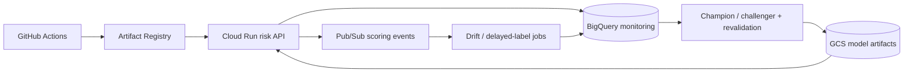

# GCP reference deployment

This repository is cloud-agnostic at the modeling layer, but `infra/gcp/main.tf` shows how the public demo maps onto a concrete GCP serving/monitoring architecture.

> This is a reference deployment for synthetic portfolio workloads, not a claim that the public repository runs a regulated production credit decision system.

## Architecture



## Why these services

### Cloud Run

The FastAPI scorer is stateless at request time, so Cloud Run is a useful reference for autoscaled container serving without introducing a Kubernetes control plane merely for portfolio value.

The Terraform example sets a bounded maximum instance count and a dedicated runtime service account. For a real banking deployment I would additionally define ingress, VPC connectivity, Cloud Armor / API gateway controls, organization policies and explicit SLO-driven autoscaling.

### Artifact Registry

Application images are versioned independently from model artifacts. This separation lets an API release and a model promotion follow different governance paths.

### Cloud Storage

Versioned object storage holds immutable model artifacts. The public model registry already records SHA-256 artifact hashes; a cloud implementation can keep registry metadata in a relational/metadata service while storing the binary artifact in GCS.

### BigQuery

The monitoring dataset is intended for append-oriented score, decision, drift and mature-outcome cohorts. It is deliberately separated from the synchronous serving path.

Typical tables would include:

- `scoring_events`
- `decision_events`
- `feature_drift_daily`
- `score_drift_daily`
- `mature_outcomes`
- `segment_performance`
- `policy_economics_daily`

### Pub/Sub

The API can publish scoring metadata asynchronously instead of synchronously blocking a customer-facing decision on analytical writes.

The event should contain identifiers and monitoring-safe features, not unrestricted raw application payloads. Sensitive fields require a separate data-governance design.

## Deployment flow

```text
commit
  -> CI / tests / container build
  -> push immutable image to Artifact Registry
  -> deploy Cloud Run revision
  -> shadow or canary traffic
  -> monitor latency/errors/score distribution
  -> promote traffic gradually
```

A **model promotion** remains a separate operation:

```text
train candidate
  -> out-of-time validation
  -> calibration / segment checks
  -> business-policy simulation
  -> champion/challenger gate
  -> immutable artifact + checksum
  -> shadow scoring
  -> approval
  -> production alias/version update
```

Keeping those flows separate is important: reverting application code and rolling back a model are related operational events, but they are not the same governance action.

## Monitoring design

### Immediate signals

Available without waiting for credit outcomes:

- API error rate and latency;
- request volume;
- missing-feature rates;
- feature PSI / distribution diagnostics;
- model score distribution;
- approve/review/decline mix;
- human review volume;
- model/version traffic share.

### Delayed signals

Available only after outcome maturity:

- ROC-AUC / PR-AUC / KS;
- Brier score and calibration error;
- bad rate among approved applications;
- segment-level performance;
- realized policy economics;
- challenger-versus-champion outcome deltas.

`src/delayed_label_monitoring.py` exists specifically so recent accounts without mature outcomes are not mislabeled as negatives.

## Senior-data-science discussion points

A useful interview answer is not simply “I would deploy it on GCP.” The design choices to discuss are:

1. **Why Cloud Run vs GKE?** Start with the operationally smaller platform when workload requirements allow it; choose GKE when network/service-mesh/GPU/custom-scheduling/sidecar/control-plane requirements justify it.
2. **Why Pub/Sub between serving and monitoring?** Decouple online latency from analytical writes and tolerate downstream retries.
3. **Why BigQuery?** Append-heavy analytical monitoring and cohort queries are a better fit than forcing operational scoring storage to do OLAP work.
4. **How do you avoid silent model swaps?** Immutable artifacts, checksums, explicit registry stages and model-version fields on every score.
5. **How do you handle delayed labels?** Separate immediate drift monitoring from mature-outcome evaluation.
6. **How do you rollback?** Cloud Run revision rollback for code; registry/model alias rollback for model artifacts; neither should silently mutate historical audit records.

## Terraform scope

`infra/gcp/main.tf` creates/reference-configures:

- required Google APIs;
- Artifact Registry;
- versioned GCS model-artifact bucket;
- BigQuery monitoring dataset;
- Pub/Sub scoring-event topic;
- dedicated Cloud Run service account;
- minimal runtime IAM grants;
- Cloud Run v2 service with bounded autoscaling.

The file intentionally leaves organization-specific controls out of the public demo rather than inventing fake production architecture.
