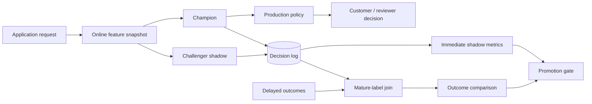

# Shadow Deployment for a Banking-Risk Challenger

A challenger should not have to make customer-facing decisions on day one just to collect production evidence.

A **shadow deployment** lets the production champion continue controlling the business decision while the challenger receives the same eligible feature payload, produces a score, and writes comparison telemetry.

## Request path



## What is safe to measure immediately

Before outcomes mature, compare operational behavior:

- score MAE / distribution difference;
- route disagreement rate under the current threshold policy;
- change in predicted human-review workload;
- p50/p95/p99 inference latency;
- error/timeout rate;
- missing-feature behavior;
- country/channel disagreement slices;
- feature/score drift.

These metrics can identify an obviously unsafe challenger early, but they do **not** prove predictive superiority.

## What requires mature labels

After the defined outcome horizon and reporting lag:

- ROC-AUC;
- average precision;
- Brier/calibration;
- KS/lift;
- expected loss under the operating policy;
- bad rate among approved cases;
- adverse-event capture;
- country/segment performance.

`src/delayed_label_monitoring.py` keeps immature unlabeled cases out of the outcome evaluation.

## Why route disagreement matters

Two models can have nearly identical AUC while sending different customers into approve/review/decline bands.

That matters operationally because a challenger can:

- overload the manual-review team;
- increase decline volume;
- change the population eventually booked by the bank;
- create new selection bias in future training data.

`src/shadow_evaluation.py` therefore measures policy-route disagreement and review-rate delta alongside score differences.

## Failure isolation

A useful shadow design makes challenger failure non-blocking:

```text
champion failure   -> customer path has a production incident
challenger failure -> log shadow error; champion decision still completes
```

This typically requires:

- separate timeout budget for the shadow request;
- no synchronous dependency from the champion response on challenger success;
- bounded queues / concurrency;
- explicit model/version identifiers;
- idempotent telemetry writes;
- alerting when shadow coverage drops.

## Promotion evidence

A promotion decision should combine several categories:

### Predictive
- AUC/AP improvement
- calibration/Brier
- segment stability

### Economic
- expected cost / expected loss
- approval and adverse-event capture

### Operational
- p95 latency
- error rate
- human-review volume

### Stability
- PSI / score drift
- feature-importance consistency
- performance across future cohorts

The executable policy in `src/champion_challenger.py` intentionally combines multiple gates instead of declaring the highest-AUC candidate the winner.

## Canary after shadow

A shadow pass is not the same as a production canary because the challenger does not influence decisions.

A conservative progression can be:

```text
offline validation
      ↓
shadow traffic
      ↓
small controlled canary
      ↓
expanded canary
      ↓
production promotion
```

Each stage should have rollback criteria.

## Audit fields

Useful per-decision telemetry includes:

- application/request ID;
- feature snapshot/version;
- champion model/version;
- challenger model/version;
- champion/challenger probabilities;
- route chosen by the actual production policy;
- hypothetical challenger route;
- inference latency/error status;
- decision timestamp;
- later outcome and outcome-observed timestamp;
- reviewer action where applicable.

This enables reproducible post-hoc comparisons without reconstructing decisions from today's model code.
