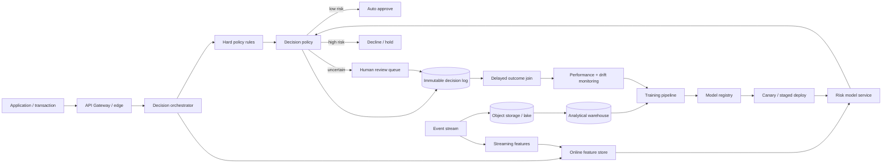

# System Design Case — Global Banking Risk Decision Platform

## Prompt

> Design a machine-learning platform that scores consumer applications globally, supports low-latency decisions, routes uncertain cases to human review, retrains from delayed outcomes, and remains auditable.

The goal of this answer is not to name every cloud service. Start from requirements, failure modes and data contracts, then map them to implementation choices.

## 1. Clarify requirements

Ask before drawing boxes:

- Is the decision credit risk, fraud, onboarding/financial crime, or several models?
- What is the maximum online decision latency?
- What fraction of applications may be sent to manual review?
- How delayed are labels/outcomes?
- Are decisions global or country-specific?
- What are availability and RTO/RPO requirements?
- Which decisions require an explanation/reason code?
- Are there hard policy rules separate from the ML model?
- What is the expected daily/peak volume?
- Are there regional data-residency constraints?

## 2. Logical architecture



## 3. Online request path

1. authenticate and validate the request;
2. assign a request / correlation ID;
3. apply deterministic eligibility/policy rules;
4. fetch point-in-time online features;
5. call versioned model endpoint with a strict timeout;
6. combine model score with policy thresholds;
7. return automatic decision or create review case;
8. write model version, feature snapshot ID, decision and reasons to the audit log.

The decision orchestrator should not silently retry non-idempotent actions without an idempotency strategy.

## 4. Feature correctness

Training/serving skew is a major risk.

Useful controls:

- one feature definition shared by offline/online paths where possible;
- point-in-time correct historical joins;
- feature freshness metadata;
- feature schema/version;
- offline/online parity tests;
- no feature computed using observations after decision time.

A feature store can help, but buying a feature-store product does not automatically guarantee leakage correctness.

## 5. Decision policy

Do not treat probability as the final business action.

Example:

```text
score < 0.08           → auto approve
0.08 <= score < 0.65   → human review
score >= 0.65          → decline / policy-dependent review
```

Thresholds should be evaluated against:

- bad/default/fraud rate among approved cases;
- approval/conversion;
- captured losses;
- review capacity;
- false-decline cost;
- expected economic loss;
- segment/country behavior.

## 6. Human review

The case should contain evidence, not only "model score = 0.71".

Reviewer interface can include:

- ranked risk signals;
- source provenance;
- missing information;
- model confidence / calibration context;
- reason codes / explanations;
- related applications/transactions;
- explicit approve / reject / request-information actions.

Log reviewer overrides separately so we can measure:

- override rate;
- useful vs harmful overrides;
- automation-bias signals;
- review latency;
- reviewer disagreement.

## 7. Delayed labels

Banking outcomes may arrive weeks/months after scoring.

Keep a stable decision record containing:

- application ID;
- model version;
- timestamp;
- decision;
- score;
- feature snapshot/reference;
- route (automatic/review);
- reviewer result if applicable.

When labels mature, join them back to decisions for cohort-based evaluation.

Avoid evaluating recent cohorts as if their labels were complete.

## 8. Monitoring

### Immediate operational signals

- request rate;
- p50/p95/p99 latency;
- model service errors;
- feature-fetch errors/freshness;
- queue depth / review backlog;
- approval/review/decline rates;
- score distribution;
- missing-value rate.

### Delayed statistical signals

- ROC-AUC / PR-AUC / KS;
- Brier/calibration;
- bad/default/fraud rate;
- threshold operating metrics;
- PSI / KS feature drift;
- segment-specific performance;
- human override outcomes.

## 9. Deployment

A safe deployment path:

```text
candidate model
   ↓
offline quality gates
   ↓
registry
   ↓
shadow / canary traffic
   ↓
compare business + system metrics
   ↓
gradual rollout
   ↓
full production
```

Keep a rollback path to the previous model version.

## 10. Failure modes

### Model endpoint unavailable

Options depend on risk appetite:

- fail closed to manual review;
- use a validated fallback model;
- apply conservative deterministic policy;
- never silently auto-approve because the model timed out.

### Feature store unavailable

Avoid producing apparently valid scores from a partial feature vector unless the model/policy explicitly supports that fallback.

### Review queue overload

Possible controls:

- risk-priority queue;
- temporary threshold adjustment under pre-approved policy;
- reviewer autoscaling/workforce controls;
- load shedding for non-critical workflows;
- explicit SLA alerts.

### Drift alert

Do not automatically retrain merely because PSI crosses one threshold. Investigate cause, outcome performance, segment behavior and data quality first.

## 11. Global / multi-region design

Global banking adds:

- data residency;
- country-specific policy;
- currency/time-zone normalization;
- different base event rates;
- local model or calibration requirements;
- regional failure isolation.

A practical architecture may have a global control plane and regional data/serving planes rather than copying all customer data into one region.

## 12. Explainability and governance

For each decision, be able to answer:

- which model version made it?
- what data/features were used?
- what deterministic rules fired?
- why was it automatic or human-reviewed?
- what explanation method was used?
- who overrode it and why?
- can the decision be reconstructed later?

## 13. GCP mapping example

One possible implementation:

| Logical concern | GCP candidate |
|---|---|
| API / service | Cloud Run / GKE + load balancing |
| Events | Pub/Sub |
| Streaming | Dataflow |
| Raw artifacts | Cloud Storage |
| Analytics | BigQuery |
| Managed ML lifecycle | Vertex AI |
| OLTP metadata | Cloud SQL / AlloyDB |
| Cache / online state | Memorystore |
| Secrets | Secret Manager |
| Monitoring | Cloud Monitoring + Logging |

The architecture should remain understandable if the interviewer swaps GCP for AWS or Azure.

## 14. Senior-level closing

A good final sentence:

> I would optimize the system around the decision and its failure cost, not around the model endpoint. The model is one versioned component inside a governed decision process with point-in-time features, explicit policy, human escalation, delayed-outcome monitoring and rollback.
